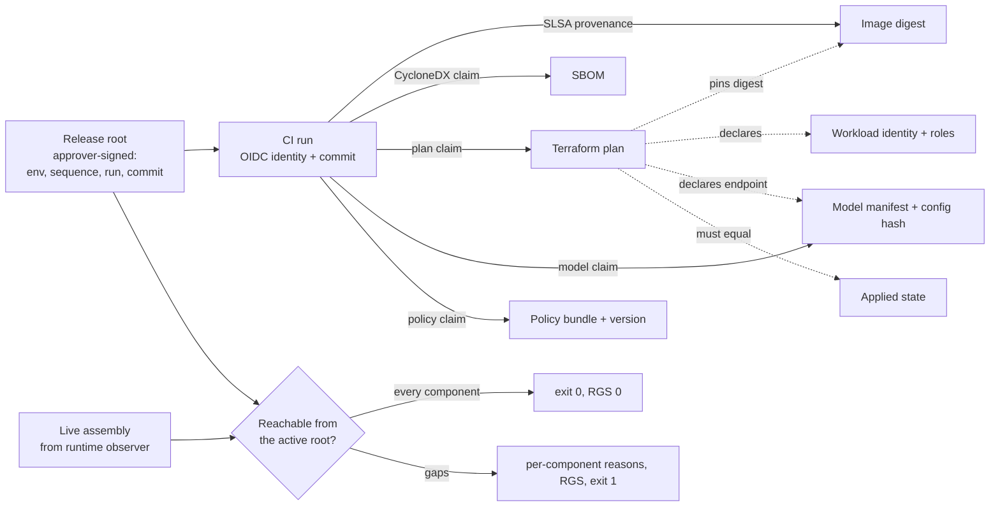

# HEPHAESTUS LEDGER

**Attested AI deployment provenance: is what is serving right now the release you approved?**

Check every live component of an AI deployment (image, SBOM, model config, infra, policy, workload identity) for reachability from one signed release root, and report each gap by component.



A container digest is not enough to answer "what AI system did we actually deploy?". The behavior
of an AI service also depends on the model endpoint and its config (model ID, version, system prompt,
temperature), the applied infrastructure, the policy bundle and the workload identity it runs as.
Each of these can be validly signed and still come from the wrong release. HEPHAESTUS LEDGER builds a
**Deployment Provenance Graph (DPG)** from signed in-toto claims and reports a **Reproducibility Gap
Score (RGS)**: the weighted count of live components that cannot be proven to descend from the active root.

> v0.1 research prototype. Runs locally with Python, no cloud account and no Docker. Signing uses
> **local test keys**: a test CA stands in for Sigstore Fulcio, a test timestamp authority for Rekor.
> All numbers are from a synthetic benchmark regenerated by the commands below.

## Worked example

Release 1.4.0 (CI run 102) is approved and deployed. Run 103 is a canary build from `main` with valid,
correctly signed provenance that was never approved. In this scenario the live endpoint serves the
canary's model config; every other component is the approved release's.

```console
$ python -m hephaestus_ledger demo --scenario model_config_from_unapproved_run --out build/canary
wrote scenario 'model_config_from_unapproved_run' to build\canary
$ python -m hephaestus_ledger verify build/canary
ok   image              reachable from the active release root
GAP  model              model manifest/config has no verified claim
ok   infra              reachable from the active release root
ok   policy             reachable from the active release root
ok   workload_identity  reachable from the active release root
ok   sbom               reachable from the active release root
RGS 3/13
$ echo $?
1
```

The gap is localized to one component. The model claim verifies on its own (signature, CA chain,
timestamp, builder identity), so the no-linking ablation and all four baselines miss this case
(see the per-scenario table in [`reports/benchmark.md`](reports/benchmark.md)). It is caught only
because the claim comes from run 103, not from the run named by the active release root.

## Results

**Tamper benchmark** ([`reports/benchmark.md`](reports/benchmark.md), [`reports/benchmark.json`](reports/benchmark.json)):
26 synthetic scenarios, of which 19 are injected provenance breaks, 4 are benign deployments and 3 are
negative cases that provenance cannot see by design. RGS weights: image 3, model 3, infra 2, policy 2,
workload identity 2, SBOM 1 (max 13). Mean true RGS over the breaks: 3.32.

| Method | Breaks detected | Rate | Exact component localization | Mean RGS on breaks | Benign flagged | Negatives detected |
|---|---|---|---|---|---|---|
| Container SBOM only (baseline) | 2/19 | 10.5% | 2/19 | 0.11 | 0/4 | 0/3 |
| Image signature only (baseline) | 1/19 | 5.3% | 0/19 | 0.16 | 0/4 | 0/3 |
| SLSA provenance, no AI config/model binding (baseline) | 4/19 | 21.1% | 0/19 | 0.63 | 0/4 | 0/3 |
| Manual release manifest (baseline) | 5/19 | 26.3% | 3/19 | 0.68 | 0/4 | 0/3 |
| DPG without graph linking (ablation) | 14/19 | 73.7% | 14/19 | 2.16 | 1/4 | 0/3 |
| **Deployment Provenance Graph (mechanism)** | 19/19 | 100.0% | 19/19 | 3.32 | 1/4 | 0/3 |

The 100% is **true by construction** (see below). What the benchmark measures is the gap between the methods:

- **Graph linking is worth 5 of 19 breaks.** With every claim verified on its own but no release root
  and no cross-edges, the ablation misses exactly the mix-and-match cases, each assembled from validly
  signed parts: a model config from an unapproved canary run, a policy bundle from the superseded
  release, the canary's workload identity, a replayed older release root, and a mutable tag moved to
  another valid main build.
- **SLSA-style image verification** (signature + certificate window + issuer/repository/ref, with the
  common `.github/workflows/.*` wildcard) sees only the image. It catches the swapped image, the fork,
  the feature branch and the expired certificate. It misses the debug-workflow build, the unpinned
  action, the moved tag, the replayed root, and every SBOM, model, config, infra, policy and identity change.
- **The manual manifest** catches post-deploy drift it records (model ID, prompt config, infra state,
  image digest) but nothing that was wrong at assembly time, a moved tag, or a policy whose label was
  kept while its content was reverted.

**Negative results.** `sbom_regenerated` is benign, but the DPG and its ablation flag it: an attached
SBOM that is not byte-identical to the attested one cannot be proven, so non-reproducible SBOM tooling
causes operational false positives. The three negative cases are missed by every method: a backdoor
merged to main and then approved normally, a provider changing weights behind the same model ID and
version, and a compromised node agent that reports the approved digest.

## Quickstart

Needs Python 3.10+.

```bash
python -m venv .venv && . .venv/bin/activate      # Windows: .venv\Scripts\activate
python -m pip install "cryptography>=42" "pytest>=8"
python -m pytest -q
python -m hephaestus_ledger demo --out build/clean                # trust root, attestations, ledger, live assembly, OCI image
python -m hephaestus_ledger verify build/clean                    # exit 0, RGS 0/13
python -m hephaestus_ledger demo --scenario replayed_release_root --out build/replay
python -m hephaestus_ledger verify build/replay                   # exit 1, per-component gaps
python -m hephaestus_ledger bench --out reports                   # the benchmark, a few seconds
```

`demo --scenario` accepts any scenario ID from the report. `verify` recomputes the image digest from
the OCI layout on disk rather than trusting the reported one.

## Mechanism

- **Artifacts** ([`world.py`](hephaestus_ledger/world.py)): images are real, deterministic OCI image
  layouts (index, manifest, config, tar layer) built in memory. SBOMs are CycloneDX 1.5 generated by this
  repository from the image's files, **not by syft**. Terraform plan and state use real Terraform 1.16.2
  output ([`fixtures/terraform`](fixtures/terraform), built-in `terraform_data`, no provider download)
  with per-release values substituted. Model manifests, policy bundles and identities are synthetic.
- **Claims** ([`attest.py`](hephaestus_ledger/attest.py)): in-toto Statement v1 in DSSE envelopes,
  Ed25519. Each CI run gets a 10-minute certificate binding an ephemeral key to GitHub-OIDC-shaped
  claims (issuer, repository, `job_workflow_ref`, ref, sha, run_id, event). A timestamp authority signs
  each payload's integrated time. The release root is a claim from an approver identity over
  (environment, sequence, run, commit).
- **Verifier** ([`verify.py`](hephaestus_ledger/verify.py)): keep claims whose CA chain, signature,
  timestamp, certificate window, signer identity and (for builds) SHA-pinned actions verify. Take the
  highest-sequence approval for the environment. Keep only claims from that root's run and commit. Then
  check each live component, including the plan's cross-edges: the running digest is pinned, the
  identity and roles are declared, the model endpoint is declared, the applied state equals the plan.
- **RGS**: the sum of weights over components with a gap. The weights are a fixed choice (behavior-defining
  code and model count most) and are not derived from anything. The report lists the flagged sets as well.

## Threat and failure model

The verifier answers one question at promotion or runtime and never deploys, rolls back or blocks
anything itself. Attestations and the OCI layout on disk are untrusted until verified; the trust root
and release ledger are trusted; the runtime observer's live assembly is **trusted but not verified**.
Assets, trust boundaries, per-threat controls and blind spots are in
[`docs/THREAT_MODEL.md`](docs/THREAT_MODEL.md).

**Failure taxonomy.** Classes of provenance break, and whether the benchmark covers them:

| Class | Benchmark scenarios | DPG |
|---|---|---|
| Artifact substitution or missing evidence | `image_swapped_after_signing`, `sbom_for_other_digest`, `sbom_missing` | detected |
| Wrong builder identity or build inputs | `fork_workflow_identity`, `other_branch_identity`, `unapproved_workflow_file`, `unpinned_action`, `expired_cert` | detected |
| Live AI config drift | `model_id_changed`, `prompt_config_changed` | detected |
| Mix-and-match of validly signed parts | `model_config_from_unapproved_run`, `stale_policy_bundle`, `wrong_workload_identity` | detected, ablation misses |
| Release replay and tag indirection | `replayed_release_root`, `mutable_tag_moved` | detected, ablation misses |
| Infra drift and privilege expansion | `tfplan_state_mismatch`, `unapproved_plan_applied`, `secret_scope_expansion` | detected |
| Label kept, content changed | `policy_version_label_spoof` | detected |
| Benign non-reproducible evidence | `sbom_regenerated` | false positive |
| Approved but malicious source | `malicious_commit_approved` (negative) | missed by every method |
| Provider-side model change behind the same ID/version | `provider_silent_model_update` (negative) | missed by every method |
| Lying runtime observer | `lying_runtime_observer` (negative) | missed by every method |
| Signing-key compromise inside the certificate window | not in the benchmark | not detectable with local keys |
| Ledger rollback by a writer to the ledger | not in the benchmark | out of scope (ledger is trusted) |
| Multi-model routes, gradual rollouts, cross-environment promotion | not in the benchmark | not modeled |

## Experiment design

- **Scenarios** ([`scenarios.py`](hephaestus_ledger/scenarios.py)): each starts from the same base world
  and changes one thing. Base world: run 101 = release 1.3.0 (approved, sequence 1), run 102 = release
  1.4.0 (approved, sequence 2, deployed), run 103 = an unapproved canary build from main (valid
  provenance). Each scenario is tagged `assembly` (tamper while the release is assembled, so the manual
  manifest records the tampered value) or `drift` (after deploy, so the manifest holds the approved value).
- **Ground truth**: each break declares the set of tampered components. Benign scenarios must produce no
  gap; negative scenarios are breaks provenance cannot see by design.
- **Baselines** ([`verify.py`](hephaestus_ledger/verify.py)). Naive: *container SBOM only* (an SBOM is
  attached and describes the running digest), *image signature only* (any valid signature over the digest,
  no identity, no time), *manual release manifest* (compare live values with what a human recorded).
  Prior-art-inspired: *SLSA provenance, no AI config/model binding*, verified like a cosign / Kyverno
  `verifyImages` admission policy (signature, timestamp in window, issuer + repository + ref, workflow
  wildcard, dependencies not inspected).
- **Ablation**: *DPG without graph linking*, every claim verified individually, no release root and no cross-edges.
- **Metrics**: breaks detected and rate; exact component localization (flagged set equals the true
  tampered set); mean RGS on breaks (a baseline counts only the components it inspects); benign flagged;
  negatives detected.
- **Regenerate**: `python -m hephaestus_ledger bench --out reports` (seed 7 by default) writes
  `reports/benchmark.json` and `reports/benchmark.md` with commit, command, Python, platform,
  cryptography version, Terraform fixture version, fixture hash and seed. `python -m pytest -q` runs the tests.

## What this result does not establish

- **Not a detection rate.** The DPG's 19/19 is by construction: the scenarios and the verifier were
  written by the same author, and every injected break violates an edge the verifier checks. The honest
  signals are the baseline and ablation gaps and the negative cases.
- **Not Sigstore.** The test CA and timestamp authority are local stand-ins. Keyless Cosign with a real
  GitHub OIDC token and Rekor inclusion proofs was not run, and there is no transparency log. A key
  holder who signs inside the certificate window is not detectable here.
- **Not real deployments.** All 26 scenarios are synthetic, with one application, one environment and
  one of each component. Model manifests, policy bundles and identities are synthetic; SBOMs are not
  produced by syft; the Terraform fixture uses `terraform_data`, not cloud resources.
- **Not runtime attestation.** The live assembly is a report from a trusted observer. Nothing here
  attests the node, so a lying observer passes (`lying_runtime_observer`).
- **Not a statement about intent or model behavior.** Provenance proves origin, not that an approved
  commit is benign or that a provider kept the weights behind a model ID.
- **Not reproducibility.** Rebuild/reproduction success is not measured. The OCI builder is
  deterministic by construction, so measuring it would say nothing.
- **Not a calibrated risk score.** The RGS weights are a fixed choice, not derived from data.

## Limitations

- **SBOM equality is by digest**, which causes the `sbom_regenerated` false positive. Comparing component
  sets would fix that at the cost of accepting SBOMs the pipeline never attested.
- There are no multi-model routes, no gradual rollouts (two revisions live) and no cross-environment promotion.
- Real provider attributes, computed values and `ignore_changes` semantics are not exercised by the
  Terraform fixture.
- The release ledger is trusted: someone with write access who deletes the newest root makes an older
  one current again.

## Research lineage

The graph-linking mechanism is not new. The contribution is an engineering one: an AI-deployment node
schema, a runtime comparison and a measured benchmark against the checks people actually run.

- **in-toto layouts** already verify a chain of signed steps whose products must match the next step's
  materials (`MATCH ... FROM <step>`). **Witness** policies do the same across attestation collections
  (`artifactsFrom`), and **Archivista** stores those collections as a graph. The DPG's root → run →
  claim linking is this idea. A Witness or in-toto policy could encode most of the checks here.
- **GUAC** ingests SBOMs, SLSA attestations and related metadata into a queryable graph. It answers
  composition and impact questions. It does not decide, per live deployment, whether a component is reachable from one approved root.
- **Sigstore policy-controller** and **Kyverno verifyImages** verify image signatures and attestation
  conditions at admission. They are the `slsa_only` baseline here, per image.
- **OpenSSF Model Signing (OMS / model-transparency)** signs model weights, and **CycloneDX ML-BOM** and
  the **SPDX 3 AI profile** describe models and datasets. None of them binds a hosted endpoint's
  config, infrastructure, policy and workload identity to one release.
- Research lineage: *The Grand Software Supply Chain of AI Systems* (Cesarano & Monperrus, arXiv
  2604.27781) names verifiability and traceability as open gaps. *Operationalising AI Bills of Materials*
  (Radanliev et al., Frontiers 2026) extends CycloneDX with AI provenance but not deployment-time identity,
  infra or policy. *Securing the AI Software Supply Chain* (Google, 2024) adapts SLSA/Sigstore and
  deploy-time authorization (Binary Authorization for Borg) to AI artifacts.

What remains after that review is narrow: treating the hosted model config, policy bundle, applied
Terraform state and workload identity as first-class nodes next to the image; checking the *observed*
runtime assembly rather than an artifact at admission; a graded, per-component RGS instead of pass/fail;
and a benchmark that shows which of these checks the common baselines skip.

## Roadmap

v0.2: keyless Cosign in CI with Rekor verification, syft-generated SBOMs, Azure Container Apps / ECS
observers, an OPA promotion gate, and exporting the DPG check as an in-toto layout or Witness policy to
test whether those tools can express it directly.

## Layout

```
hephaestus_ledger/attest.py     canonical JSON, DSSE, test CA / timestamp authority, verification
hephaestus_ledger/world.py      OCI layouts, CycloneDX SBOMs, Terraform rendering, CI runs, release roots
hephaestus_ledger/verify.py     DPG verifier, no-linking ablation, four baselines, RGS
hephaestus_ledger/scenarios.py  26 scenarios (benign, breaks, negatives)
hephaestus_ledger/bench.py      benchmark, report, provenance
fixtures/terraform/             main.tf and the real plan/state JSON it produced
reports/                        generated evidence (JSON + Markdown)
```

MIT licensed.
